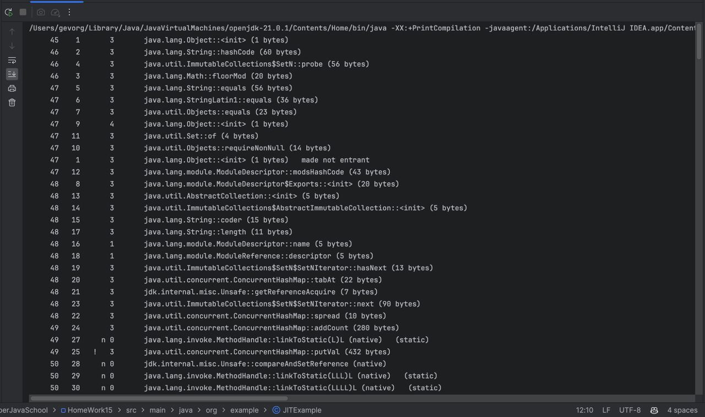
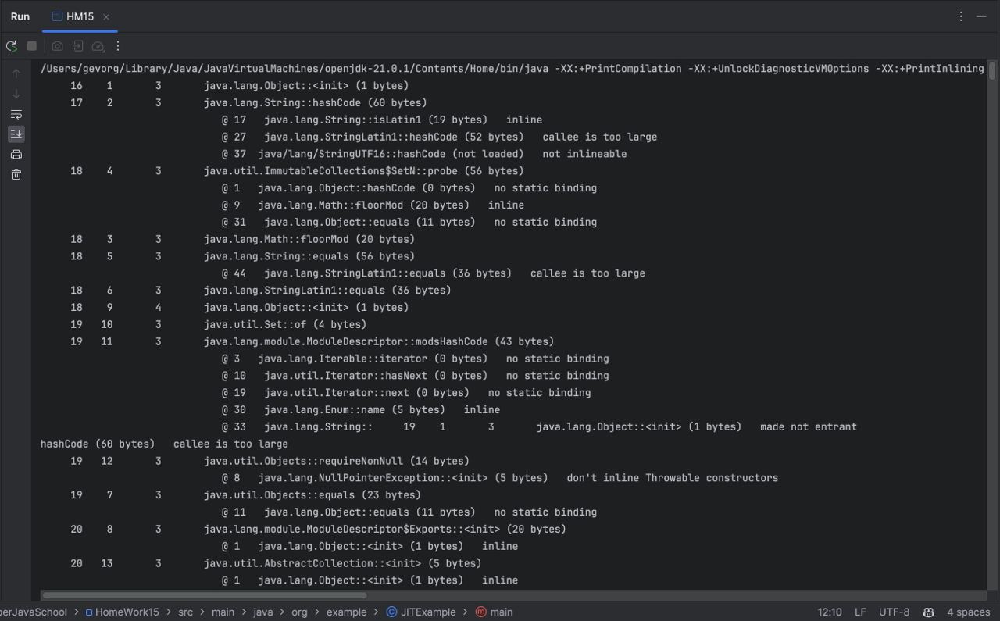
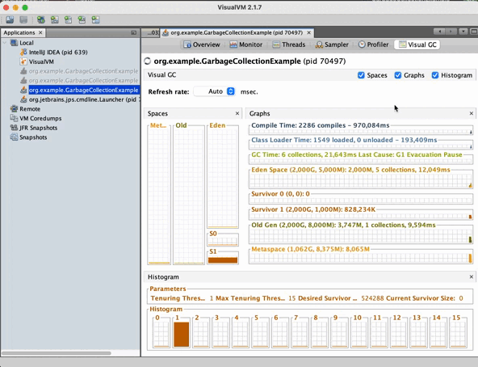
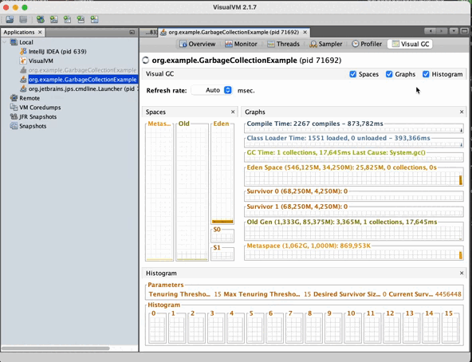
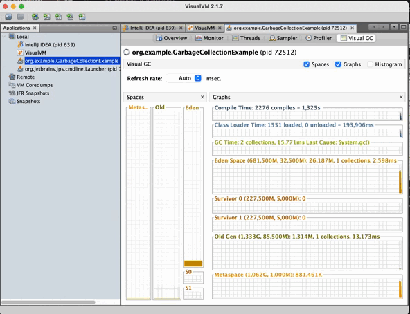
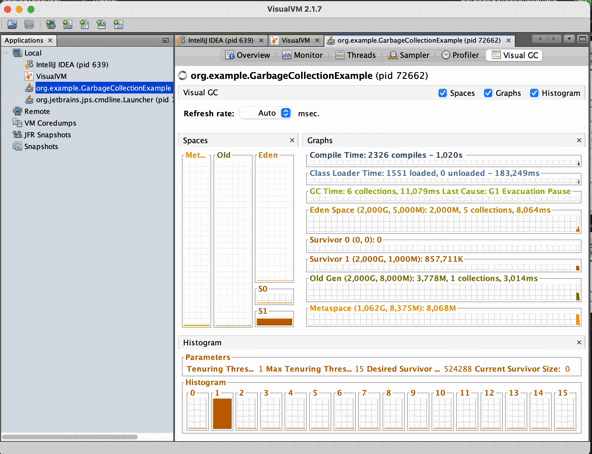

# Домашнее задание №15

## Задание #1 по JIT
Сделать цикл на 100000 итераций, в цикле в предварительно созданную Map<Integer, String> сложить ключ - индекс, значение - "value" + индекс

Запустить с опцией -XX:+PrintCompilation, проанализировать информацию в консоли

Запустить с опцией -XX:+PrintCompilation -XX:+UnlockDiagnosticVMOptions -XX:+PrintInlining , проанализировать информацию в консоли

## Решение и пояснения
JIT (Just-In-Time) компилятор в Java выполняет компиляцию байт-кода в машинный код во время выполнения программы. Он пытается оптимизировать исполняемый код, учитывая активное использование приложения. Для того чтобы JIT мог принимать более обоснованные решения о том, какие части кода компилировать и как их оптимизировать, он собирает информацию о том, как часто и как быстро вызываются различные методы.

В данном домашнем задании создается цикл с 100 000 итераций, в котором происходит заполнение Map значениями. Используя опции -XX:+PrintCompilation, мы можем наблюдать, какие методы в этом цикле подвергаются компиляции JIT, и какие уровни оптимизации применяются.

Например, если мы видим, что методы внутри цикла регулярно компилируются с более высокими уровнями оптимизации, это может свидетельствовать о том, что JIT считает эти методы критически важными для производительности и пытается максимально оптимизировать их выполнение.

Таким образом, данное домашнее задание предоставляет нам возможность изучить, как JIT компилирует и оптимизирует код, основываясь на его активности во время выполнения.

1. **Запуск с опцией -XX:+PrintCompilation:**

Для начала я создал класс `JITExample` и определил в нем метод `main`, в котором я создал цикл на 100000 итераций и в каждой итерации добавлял в `Map` новый элемент.

Настройка VM options для компиляции:

Открыл настройки конфигурации в IntelliJ IDEA.
Добавил опцию `-XX:+PrintCompilation` в поле "VM options".

Затем я запустил приложение и проанализировал информацию в консоли.

**По столбцам слева направо:**

* **Временная метка** - в миллисекундах с момента запуска приложения.
* **ID компиляции** - Уникальный идентификатор для каждой компиляции. Каждый раз, когда метод компилируется, ему присваивается уникальный номер. Этот номер увеличивается с каждой новой компиляцией метода во время выполнения программы.
* **Атрибуты** - состояние компиляции с пятью возможными значениями:
    
    % - произошла замена в стеке;
    
    s - метод синхронизирован;
    
    ! - метод содержит обработчик исключений;

    b - компиляция происходила в блокирующем режиме;

    n - компиляция преобразовала оболочку в собственный метод.
* **Уровень компиляции** - имеет значение от 0 до 4.
* **Название метода** - имя скомпилированного метода.
* **Размер метода в байтах.**

2. **Запуск с опцией -XX:+PrintCompilation -XX:+UnlockDiagnosticVMOptions -XX:+PrintInlining:**

Для этого я добавил опции `-XX:+UnlockDiagnosticVMOptions -XX:+PrintInlining` в поле "VM options", и снова запустил приложение и проанализировал информацию в консоли.


Опция -XX:+PrintInlining предоставляет дополнительную информацию о том, какие методы были проинлайнены (встроены) в другие методы. В выводе видно, что метод java.lang.String::hashCode был инлайнен в другие методы, такие как java.lang.String::equals и java.util.ImmutableCollections$SetN::probe.

Опция -XX:+UnlockDiagnosticVMOptions позволяет использовать дополнительные диагностические опции, такие как -XX:+PrintInlining. Без этой опции некоторые диагностические возможности могут быть заблокированы по умолчанию.

Строки вида @ XX SomeClass::someMethod, указывают на место в коде, где метод был инлайнен. В данном контексте, XX - это номер строки в исходном коде метода, в который был проинлайнен вызываемый метод. Например, @ 17 java.lang.String::isLatin1 (19 bytes) говорит о том, что метод isLatin1 из класса java.lang.String был инлайнен в строке 17.

В выводе также присутствуют строки, указывающие, что некоторые методы не были инлайнены, например, @ 37 java/lang/StringUTF16::hashCode (not loaded) not inlineable. Это может произойти, если JVM по каким-то причинам не решает инлайнить данный метод.

Эта информация полезна для оптимизации производительности приложения и понимания того, какие методы компилятор решает встраивать в другие методы для улучшения быстродействия.

## Задание #2 по GC
Из %JAVA_HOME%\bin запустить jvisualvm, установить через пункт меню Tools\Plugins\Available Plugis плагин: Visual GC

Запустить приложение создающее много объектов с разными GC, посмотреть в jvisualvm как заполняются объекты в разных областях памяти(heap)

## Решение и пояснения
Давайте рассмотрим четыре типа сборщиков мусора в Java: Serial, Parallel, G1 (Garbage First), и Z1 (Z Garbage Collector).

1. **Serial Collector:**
  - **Описание:** Serial Collector является простым сборщиком мусора, который работает в одном потоке. Он применяется в небольших приложениях или на устройствах с ограниченными ресурсами.
  - **Преимущества:** Низкое потребление ресурсов, подходит для простых приложений с небольшим объемом данных.
  - **Когда использовать:** В приложениях с ограниченными ресурсами или небольшим объемом данных.

2. **Parallel Collector:**
  - **Описание:** Parallel Collector, также известный как Throughput Collector, использует несколько потоков для выполнения сборки мусора. Он старается максимизировать пропускную способность, что делает его хорошим выбором для многозадачных приложений.
  - **Преимущества:** Улучшенная пропускная способность, хорошая производительность для многозадачных приложений.
  - **Когда использовать:** В приложениях среднего и крупного размера, где важна производительность.

3. **G1 Collector:**
  - **Описание:** G1 Collector представляет собой сборщик мусора с целью достижения баланса между производительностью и временем паузы. Он разбивает кучу на регионы и пытается собирать мусор в тех регионах, где он наиболее эффективен.
  - **Преимущества:** Управление временем паузы, хорошая производительность для приложений среднего размера.
  - **Когда использовать:** В приложениях, где важно управление временем паузы и имеется средний объем данных.

4. **Z Garbage Collector (ZGC):**
  - **Описание:** ZGC - это сборщик мусора с низким временем паузы, разработанный для обеспечения предсказуемости времени ответа на приложениях с большими объемами памяти.
  - **Преимущества:** Очень низкое время паузы, подходит для больших приложений с большими объемами данных.
  - **Когда использовать:** В крупных приложениях, где критично минимизировать время паузы.

5. **Флаги для включения:**
  - **Serial Collector:** `-XX:+UseSerialGC`
  - **Parallel Collector:** `-XX:+UseParallelGC`
  - **G1 Collector:** `-XX:+UseG1GC`
  - **ZGC:** `-XX:+UseZGC`

Эти флаги можно использовать при запуске JVM для указания конкретного сборщика мусора. Например, `java -XX:+UseG1GC -jar YourApp.jar` использовать G1 Collector.

**Для выполнения этого задания я написал такой код:**
```java
public class GarbageCollectionExample {
    public static void main(String[] args) {
        ArrayList<Object> list = new ArrayList<>();

        for (int i = 0; i < 100000; i++) {
            list.add(new Object());
        }

        for (Object obj : list) {
            System.out.println(obj.toString().length());
        }

        // Освобождаем ссылку на список
        list = null;

        // Запускаем сборщик мусора (можно вызвать System.gc(), но это не гарантирует немедленное выполнение)
        System.gc();

        // Задержка для наблюдения результатов в VisualVM
        try {
            Thread.sleep(50000);
        } catch (InterruptedException e) {
            e.printStackTrace();
        }
    }
}
```
**Запустил его и подключился к процессу в VisualVM.**

1. Такой результат без флагов GC:




2. Такой результат с флагом -XX:+UseSerialGC:




3. Такой результат с флагом -XX:+UseParallelGC:




5. Такой результат с флагом -XX:+UseG1GC:




В JVM (Java Virtual Machine) память кучи делится на разные области, каждая из которых предназначена для определенного типа данных и выполняет свои функции в процессе управления памятью. Вот основные области кучи:

1. **Young Generation (Молодое поколение):**
  - **Создание объектов:** В этой области создаются новые объекты. Область молодого поколения разделена на три части: Eden (Эден) и два S0 и S1 (Survivor) - области выживших. При создании объекта он помещается в Eden.
  - **Движение объектов:** После каждой сборки мусора в молодом поколении выжившие объекты перемещаются между областями S0 и S1.

2. **Old Generation (Старшее поколение):**
  - **Переход из молодого поколения:** Объекты, которые пережили несколько циклов сборки мусора в молодом поколении, могут быть перемещены в старшее поколение. Область старшего поколения предназначена для объектов, которые существуют долгое время и менее подвержены сборке мусора.
  - **Сборка мусора:** Сборка мусора в старшем поколении происходит реже, чем в молодом поколении, и может быть более интенсивной.
3. **Metaspace (Метаспейс):**
  - **Создание метаданных:** В Metaspace хранятся метаданные классов, методов и другие данные, связанные с выполнением Java-приложения.
  - **Автоматическое увеличение размера:** По сравнению с PermGen в старых версиях JVM, Metaspace автоматически увеличивается при необходимости, избегая проблем с недостатком памяти.

В ходе выполнения Java-приложения объекты могут перемещаться между этими областями в зависимости от их жизненного цикла и стратегии управления памятью, выбранной для JVM.

Проанализировав графические отображения в VisualVM, можно обратить внимание на следующее:
- Какие объекты создаются в области молодого поколения (Eden) и как часто происходят сборки мусора в этой области.
- Какие объекты переходят в старшее поколение и как часто происходят сборки мусора в старшем поколении.
- Поведение Metaspace и его использование метаданных приложения.

Такой анализ может помочь оптимизировать параметры сборки мусора и улучшить производительность приложения.